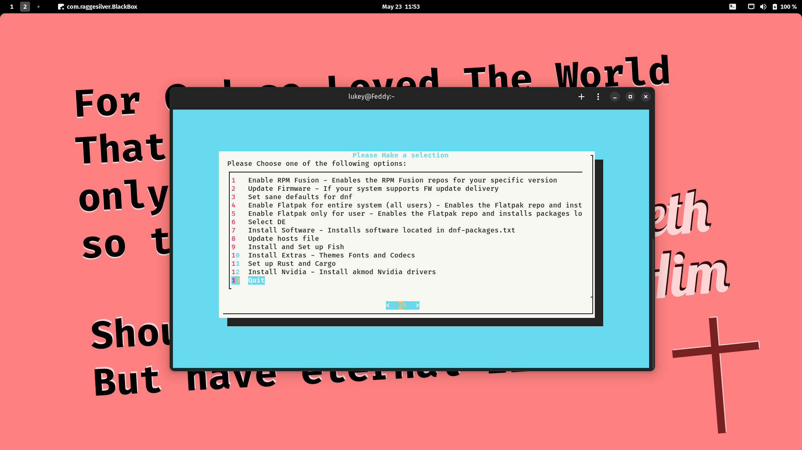

# Fedora-Setup a Post Install Helper Script

## What's all this then?

Fedora-Setup is a personal script I created to help with post install tasks such as tweaks and software installs. It's written in Bash and utilises Dialog for a friendlier menu system.

Dialog must be installed for the menu system to work and as such the script will check to see if Dialog is installed. If not, it will ask you to install it.

## Usage
1. Set the script to be executable `chmod -x fedora-setup.sh` \
2. Run the script `./fedora-setup.sh`

## Files

- **flatpak-packages.txt** - This file contains a list of all flat packages to install on the system. you can customise this with your choice of applications by application-id.
- **flatpak-packages-user.txt** - This file contains a list of all flat packages to install as user. you can customise this with your choice of applications by application-id.
- **dnf-packages.txt** - This file contains a list of all applications that will be installed via the Fedora and RPMFusion repositories.

## Screenshot

# Options

- ## Enable RPM Fusion
  - Enables RPM Fusion repositories using the official method from the RPM Fusion website. - [RPM Fusion](https://rpmfusion.org)
  > RPM Fusion provides software that the Fedora Project or Red Hat doesn't want to ship. That software is provided as precompiled RPMs for all current Fedora versions and current Red Hat Enterprise Linux or clones versions; you can use the RPM Fusion repositories with tools like yum and PackageKit.

- ## Update Firmware
  - Updates firmware providing you have hardwar that supports it.

- ## Speed up DNF
  - changes the dnf.conf to a custom one with better defaults.

- ## Enable Flatpak and Packages (For system, user or both)
  - Adds the flatpak repo, updates and installs the packages specified in flatpak-packages.txt and/or flatpak-packages-user.txt

- ## Install Software
  - Installs the pieces of software you specify in dnf-packages.txt

- ## Set up Fish 
  - installs fish and sets it as the default shell
  - installs the [Fisher Plugin Manager](https://github.com/jorgebucaran/fisher)
  
- ## Install Extras
  ### Installs the following theme:
    - [**Papirus Icon Theme**](https://github.com/PapirusDevelopmentTeam/papirus-icon-theme)
    - [**Papirus Folders**](https://github.com/PapirusDevelopmentTeam/papirus-folders)
  ### Along with the following fonts
    - [**Iosevka Term Fonts**](https://github.com/be5invis/Iosevka)
    - [**Terminus Fonts**](https://terminus-font.sourceforge.net/)
    - [**Terminus Fonts Console**](https://terminus-font.sourceforge.net/)
    - [**Google Noto Fonts Common**](https://fonts.google.com/noto/specimen/Noto+Sans)
    - **mscore-fonts-all**
    - **Fira Sans**
    - **JetBrains Nerd Font**
    - **Ubuntu**
    - **better fonts by dawid** - [Dawid's COPR](https://copr.fedorainfracloud.org/coprs/dawid/better_fonts/)
  ### Installs the following extras
    - **Sound and video group**
    - **libdvdcss**
    - **gstreamer plugins**
  ### Install Nvidia
    - **Installs the akmod-nvidia driver from the RPMFusion repo's**

- ## Set defaults in Gnome:
    - Settings accourding to that in gsettings.sh
        - sets cloch to 24 hours
        - shows date on bar
        - sets some better fonts as default
        - Centers new windows by default
