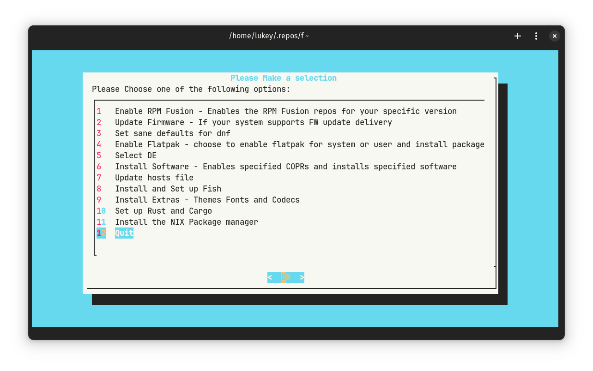

# Fedora-Setup a Post Install Helper Script

## What's all this then?

Fedora-Setup is a personal script I created to help with post install tasks such as tweaks and software installs. It's written in Bash and utilises Dialog for a friendlier menu system.

Dialog must be installed for the menu system to work and as such the script will check to see if Dialog is installed. If not, it will ask you to install it.

## Usage
- I recommend forking this repo and making the changes in the package lists, etc to work as per your setup now and in the future
```bash 
git clone https://github.com/AvalancheBreakdown/fedora-setup.git
cd fedora-setup
```
Edit the files as required, then run the script as:

``` bash
  ./fedora-setup.sh
```
## Files

1. **flatpak-packages.txt** - This file contains a list of all flat packages to install on the system. you can customise this with your choice of applications by application-id.
2. **dnf-packages.txt** - This file contains a list of all applications that will be installed via the Fedora, RPMFusion and COPR repositories.
3. **cargo-packages.txt** - This file contains a list of all crates that can be installed via Cargo.
4. **gsettings.sh** - Contains settings to change some of the defaults of GNOME
5. **hosts.sh** - Contains the link to the hosts file that can replace the default one.
6. **dnf-changes.txt** - Contains additions that will be added to the end of the /etc/dnf/dnf.conf file. 

## Screenshot



# Options

- ## Enable RPM Fusion
  - Enables RPM Fusion repositories using the official method from the RPM Fusion website. - [RPM Fusion](https://rpmfusion.org)
  > RPM Fusion provides software that the Fedora Project or Red Hat doesn't want to ship. That software is provided as precompiled RPMs for all current Fedora versions and current Red Hat Enterprise Linux or clones versions; you can use the RPM Fusion repositories with tools like yum and PackageKit.

- ## Update Firmware
  - Updates firmware providing you have hardware that supports it.

- ## Speed up DNF
  - Appends the /etc/dnf/dnf.conf with better defaults as specified in dnf-changes.txt.

- ## Enable Flatpak and Packages (via system or user installation)
  - Adds the flatpak repo, updates and installs the packages specified in flatpak-packages.txt and/or flatpak-packages-user.txt

- ## Select Desktop Environment
  - Lets you select from a [list of DEs](assets/de-installer.png) provided by Fedora.
  - Includes KDE Plasma, GNOME, XFCE, Budgie, Sway, i3, LXDE, LXQT, Cinnamon, Mate (along with Compiz) and Deepin

- ## Install Software
  - Installs the pieces of software you specify in dnf-packages.txt
    - **Note:** Do not leave empty lines on the top or bottom of the file
- ## Hosts File
    - Downloads hostfile specified in hosts.sh
    - By default uses [StevenBlack](https://github.com/StevenBlack/hosts)

- ## Set up Fish 
  - installs fish and sets it as the default shell
  - installs the [Fisher Plugin Manager](https://github.com/jorgebucaran/fisher)
  
- ## Install Extras
  ### Installs the following Icon Theme
    - [**Papirus Icon Theme**](https://github.com/PapirusDevelopmentTeam/papirus-icon-theme)
    - [**Papirus Folders**](https://github.com/PapirusDevelopmentTeam/papirus-folders)
  ### Along with the following fonts
    - [**Iosevka Term Fonts**](https://github.com/be5invis/Iosevka)
    - [**Terminus Fonts**](https://terminus-font.sourceforge.net/)
    - [**Terminus Fonts Console**](https://terminus-font.sourceforge.net/)
    - [**Google Noto Fonts Common**](https://fonts.google.com/noto/specimen/Noto+Sans)
    - **mscore-fonts-all**
    - **Fira Sans**
    - **JetBrainsMono Nerd Font**
    - **Ubuntu**
    - **better fonts by dawid** - [Dawid's COPR](https://copr.fedorainfracloud.org/coprs/dawid/better_fonts/)
  ### Installs the following extras
    - **Sound and video group**
    - **libdvdcss**
    - **gstreamer plugins**

- ## Set Up Rust and Cargo
    - Installs Rust along with Cargo and the cargo crates specified in cargo-packages.txt

- ## Install the NIX Package manager
    - Just as the title says

- ## Set the hostname
    - using nano

- ## Set defaults in Gnome:
    - Settings accourding to that in gsettings.sh
        - sets clock to 24 hours
        - shows date on bar
        - sets some better fonts as default
            - Fira Sans for Docnument and Interface
            - JetBrainsMono Nerd Font for Monospace
        - Sets Icon Theme to 'Papirus-Dark'
        - Centers new windows by default
        - Adds some keybindings

## To Do 
- [ ] Add method to restore a borg backup

